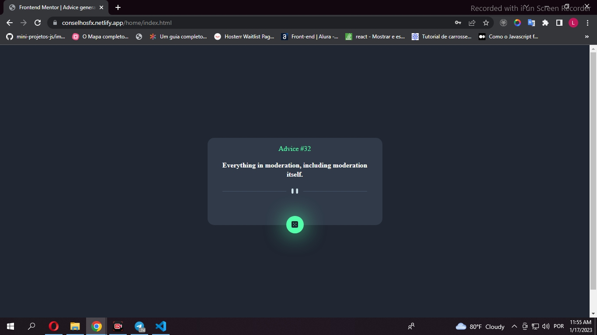

<h1 align='center'>Gerador de conselhos </h1>

para acessar a página basta inserir um e-mail e senhas válidos

 após acessar a aplicação basta clicar no dado para ver um novo conselho 

<h2> Tecnologias </h2>
<ul>
<li>SCSS</li>
<li>HTML</li>
<li> JAVASCRIPT</li>
<li>ASYNC / AWAIT</li>
</ul>